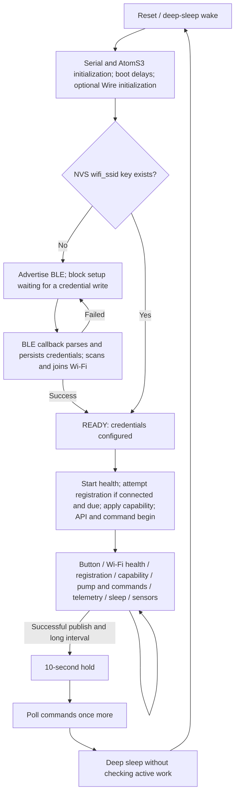

# Anthos node firmware reliability and maintainability audit

**Date:** 2026-09-15\
**Revision inspected:** `7809acc71d1c4b87c4add30757ae538e2e595d2e`\
**Target:** `node/`, M5Stack AtomS3 Lite / ESP32-S3\
**Disposition:** Audit only. No implementation or hardware operation performed.

The initial `git status --short` was empty. `AGENTS.md` was read. All 37 production files in `node/src/`, `node/platformio.ini`, `node/scripts/load_env.py`, and the sole file in `node/test/` were read. Server, shared, app, dependency source, and specifications were inspected where they affect firmware behavior. The requested report is the only authored repository change; compilation updated ignored build/dependency artifacts. No files were staged and no commit was created. Hindsight knowledge was searched and listed; its only page concerned logo exploration and supplied no firmware evidence. Earlier general repository audits were not used to establish findings.

File references below identify the inspected revision. Library references identify the resolved versions, which matter: the source-compatible ArduinoJson 7 wrapper behaves differently from ArduinoJson 6. **Confirmed** means the defect follows from executable source and its actual consumer; it does not imply reproduction on hardware. **High-confidence risk** means the mechanism is established but an environmental, electrical, or library-runtime condition remains unmeasured. **Plausible risk** identifies a credible but less certain failure. **Unverified** identifies behavior requiring additional evidence. Severity reflects impact, separately from confidence. No critical-severity defect is asserted.

## 1. Executive assessment

**The firmware has a workable foundation, but its integrated lifecycle is not reliable enough to trust for unattended watering.** Ownership is mostly simple, individual files are small, and several ordinary recovery mechanisms are sensible. The main weaknesses are at the boundaries between features: pump timing versus networking, sleep versus command completion, RAM configuration versus reboot, BLE versus asynchronous tasks, and sensor availability versus measurement validity.

The concern that it “barely holds together” is **supported for interrupted provisioning, power saving, and physical actions**, rather than for every part of the firmware. A configured, always-awake node on a responsive network can plausibly work well. That happy path does not exercise several deterministic defects. These are more than cosmetic issues, but they do not justify a wholesale rewrite. Incremental hardening of a few lifecycle boundaries is viable.

### Three most important risks

1. **A pump's requested duration is not an enforced safety limit.** HTTP operations postpone the only code that turns it off; sleep can interrupt an active action; no independent maximum exists; and reboot before acknowledgement can repeat an action. See D01–D04 and R01.
2. **Provisioning is not a dependable end-to-end recovery path.** The app's native BLE calls do not match its declared plugin API; the optional hub URL has no discovery fallback; credentials become authoritative before validation; and BLE is not actually shut down. See D06–D09 and R02.
3. **Power and telemetry can tell a false story.** Acknowledged power settings disappear on every reboot/deep-sleep wake. ENV sensors can stay unavailable indefinitely or continue reporting stale/default data with fresh server timestamps. See D05, D10–D12.

### Confidence and verification limits

Confidence is high in the source-level findings and contract mismatches. A real firmware build succeeded; 19 selected server tests and 7 selected app/shared-consumer tests passed. The firmware test image compiled, but **zero firmware test cases were executed**: the only existing test writes NVS and drives GPIO39 on an ESP32. There is no host firmware test environment. No device, BLE radio session, GPIO waveform, ADC voltage, bus fault, power measurement, watchdog behavior, or endurance run was tested. Consequently this is an evidence-based software assessment, not hardware qualification.

## 2. Runtime model

### Ownership and lifetimes

`main.cpp:3` constructs one static `NodeApp`. Its members own the subsystems for the life of the program. References are constructed in a sensible order: logger → health/sensors/pump → API → commands. `CommandClient` refers to `ApiClient`; `ApiClient` does not refer back to commands. No application-level ownership cycle was found. `SensorManager` directly owns BH1750, ENV, and Earth drivers; `EnvSensor` owns a unit manager and three candidate units. `ProvisioningManager` owns `BleProvisioning`, which registers itself as a NimBLE callback object. `NvsConfig` is a collection of static accessors, with an unrelated RAM interval hidden inside it.

Sources: [NodeApp.h:27](../../node/src/NodeApp.h#L27), [main.cpp:3](../../node/src/main.cpp#L3), [SensorManager.h:17](../../node/src/SensorManager.h#L17), [EnvSensor.h:15](../../node/src/EnvSensor.h#L15).



### Boot sequence and implicit states

1. `NodeApp::begin()` initializes Serial and calls `AtomS3.begin(true)`. It waits 8 seconds if no Wi-Fi key exists, then always waits another 1.5 seconds. M5 board initialization happens **before** application pump initialization.
2. Unless `PortMode::EarthOnly`, it initializes Arduino `Wire` on SDA=2/SCL=1, requests 50 kHz, and waits 100 ms. The `I2CBus` member is not used to initialize or recover the bus; its scan method is never called.
3. `ProvisioningManager` checks only the existence of `wifi_ssid`. Its only named states are `NO_CREDS` and `READY`. `READY` does not mean joined, registered, authenticated, or hardware-ready.
4. Without that key, `begin()` blocks inside BLE provisioning. A credential write callback persists SSID/password/optional URL and performs synchronous Wi-Fi scans and up to three 30-second joins. Failure reopens advertising after one second. Missing/invalid input has no terminal status. Factory-reset polling is outside this blocking path.
5. With a stored key, setup proceeds without waiting for Wi-Fi. `NodeHealth` requests a join at the next eligible five-second retry. With a successful fresh BLE join, Wi-Fi is already connected.
6. If connected and the registration timer is due, `HubClient` checks the stored URL's `/api/health`, then POSTs `/api/register`. No mDNS query exists. It persists capability and device token; `NodeApp` separately persists a changed node ID.
7. A persisted capability triggers `pump.begin()` and `sensors.begin()`. ENV initialization is omitted there and instead occurs lazily from `env.read()`. `api.begin()` attempts telemetry **before any scheduled sensor read**. `commands.begin()` can poll afterward. On a fast configured reboot, network operations may simply be skipped until later loop iterations.

Sources: [NodeApp.cpp:35](../../node/src/NodeApp.cpp#L35), [ProvisioningManager.cpp:6](../../node/src/ProvisioningManager.cpp#L6), [BleProvisioning.cpp:172](../../node/src/BleProvisioning.cpp#L172), [NodeHealth.cpp:53](../../node/src/NodeHealth.cpp#L53), [HubClient.cpp:40](../../node/src/HubClient.cpp#L40), [SensorManager.cpp:5](../../node/src/SensorManager.cpp#L5).

### Steady-state loop, in actual order

| Order | Work | Consequence |
|---|---|---|
| 1 | `AtomS3.update()`, factory-reset button | Button responsiveness depends on the previous iteration finishing. |
| 2 | Wi-Fi reconnect request and serial health heartbeat | Wi-Fi state is queried live, not retained as a stale connected flag. |
| 3 | Health GET + registration POST whenever five seconds have elapsed | Runs even after successful registration, including while watering. |
| 4 | Apply changed persisted capability | Reinitializes pump/Earth/light before command processing. |
| 5 | Pump deadline check; completion ACK retry; command GET; per-command logs/actions/ACKs | Pump servicing happens once, before the blocking command work. |
| 6 | Telemetry POST from cached sensor values | This does not take a new measurement. |
| 7 | Consume successful publication and set a hold deadline; evaluate sleep | Final command poll can introduce new work immediately before sleep. |
| 8 | If interval elapsed, read all sensors; otherwise `delay(10)` | Reads occur after publication and can be skipped by sleep. |

Source: [NodeApp.cpp:76](../../node/src/NodeApp.cpp#L76). Missed intervals are coalesced rather than replayed; there is no sample or telemetry backlog. This bounds firmware storage use but loses outage history. A POST whose response is lost may have been accepted by the server; there is no sample identifier to distinguish retries or repeated cached measurements.

### Timing and blocking budget

| Operation | Actual policy |
|---|---|
| Sensor read, telemetry, regular command poll | One shared RAM interval; default 1,000 ms. Configured read/command constants in `AppConfig` do not control these calls. |
| Wi-Fi request, registration retry/sync, sensor initialization retry | 5,000 ms using unsigned elapsed-time subtraction. No exponential backoff or jitter. ENV retry only remains reachable while its availability flags are false. |
| Health serial report | 5,000 ms. |
| BLE join | Synchronous network scan, then 30 s primary BSSID, optionally 30 s secondary and 30 s unpinned fallback; scan overhead is additional. |
| HTTP receive timeout | Health/ingest/log/queue/ACK: 2 s; registration: 5 s. These are not whole-operation deadlines. |
| TCP connection / DNS | The resolved Arduino core separately defaults TCP connect to 5 s; hostname lookup can wait about 15 s and also wait for another DNS lookup. |
| Sleep policy | Interval ≥300,000 ms; 10,000 ms hold following a successful ingest; timer sleep for the full interval, plus preceding hold/boot/network overhead. |

The HTTP methods are synchronous on the main loop. TCP/DNS waits, response reads, per-command log POSTs, and registration can accumulate; the number of queued commands is not bounded. Idle tasks may run during library waits, so this is **not proof of a watchdog reset**. It is proof that application pump servicing, sensing, button polling, and health reporting can be postponed. The resolved Arduino core initializes `loopTaskWDTEnabled=false`; firmware never enables it. See [HTTPClient 2.0.17 timeout fields](https://github.com/espressif/arduino-esp32/blob/2.0.17/libraries/HTTPClient/src/HTTPClient.h#L279) and [WiFiGeneric hostname lookup](https://github.com/espressif/arduino-esp32/blob/2.0.17/libraries/WiFi/src/WiFiGeneric.cpp#L1566). App evidence: [AppConfig.h:19](../../node/src/AppConfig.h#L19), [NvsConfig.cpp:85](../../node/src/NvsConfig.cpp#L85), [PowerPolicy.h:7](../../node/src/PowerPolicy.h#L7).

### Persisted configuration and recovery

| Location | Values and semantics |
|---|---|
| NVS namespace `anthos` | `wifi_ssid`, `wifi_pass`, `server_url`, `node_id`, `node_capability`, `device_token`. Each setter opens, writes, and closes independently; results are ignored. |
| Ordinary static RAM | `sIntervalMs`, default zero → 1,000 ms fallback. The three interval getters/setters are aliases, not independent settings and not persistent. |
| Driver/runtime RAM | Last sensor values, availability, applied capability, active pump ID, completion/ACK flags, retry timestamps and sleep hold. All are lost on reboot. |
| Build inputs | `.env` is read by the firmware script. Of its legacy firmware definitions, production code only consumes `ANTHOS_PORT_MODE`; credentials/ID/host/push definitions do not configure the current clients. |

`factoryReset()` clears `anthos` and restarts without checking either operation. A normal reset does not erase NVS. A deep-sleep wake reloads the application and ordinary RAM state; it is not a continuation of `NodeApp::loop()`. [ESP-IDF sleep semantics](https://docs.espressif.com/projects/esp-idf/en/v4.4.7/esp32s3/api-reference/system/sleep_modes.html#entering-deep-sleep). Interrupted registration is generally recoverable if the URL and Wi-Fi are valid because the hub reuses the same hardware identity and returns its existing token. Interrupted credential storage is different: an SSID key alone suppresses onboarding. Sources: [NvsConfig.cpp:105](../../node/src/NvsConfig.cpp#L105), [NvsConfig.cpp:141](../../node/src/NvsConfig.cpp#L141), [NvsConfig.cpp:157](../../node/src/NvsConfig.cpp#L157), [load_env.py:31](../../node/scripts/load_env.py#L31).

### Hardware, sensors, and asynchronous work

- **AtomS3 Lite pin mapping:** Grove yellow=G2/white=G1 matches the requested I2C wiring. G8 and G39 are exposed bottom pins; the application uses G8 for analog moisture and G39 for Earth digital input or pump enable. The button is G41. G39 is **not input-only on ESP32-S3**; applying original ESP32/Atom Lite restrictions would produce a false finding. [M5Stack AtomS3 Lite pin map](https://docs.m5stack.com/en/core/AtomS3%20Lite), [resolved M5Unified button mapping](https://github.com/m5stack/M5Unified/blob/002b75f/src/M5Unified.cpp#L1747).
- **Port mode and capability are different controls:** build-time `i2c`/`earth`/`all` chooses which interfaces can be used; runtime `earth`/`watering` chooses G39's behavior. `watering` cannot enable analog moisture in an `i2c`-only build. The audited local build uses `all`; a build without the override defaults to `i2c`.
- **DLight:** BH1750 at 0x23, continuous high-resolution mode. Initialization/read errors clear availability and retry. Measurement-not-ready retains the previous value.
- **ENV:** probes SHT30 0x44 plus QMP6988 0x70, or BME688 0x77/0x76. It adds units only on the first attempt, ignores unit-manager and measurement-start return values, and prioritizes fresh ENV Pro output over ENV-III. It keeps temperature, humidity and pressure in shared cached fields. Compiled ENV Pro uses BSEC2; the explicit later request for Forced mode does not override an already running periodic measurement.
- **Earth:** no discovery protocol. Enabling the port marks it available without a physical probe. `analogReadMilliVolts` and `analogRead` take two separate samples; only the latter raw 12-bit count is sent. Digital probe data is omitted for watering. Absence, floating input and soil changes cannot be distinguished by this implementation.
- **BLE concurrency:** NimBLE calls `onWrite()` from its host task; Wi-Fi disconnect callbacks execute through the Arduino event task. Their ordinary booleans/reason byte are shared with setup/main-loop code without a queue, mutex, or atomics. Application-owned callback objects have static lifetime, but that does not make access synchronized. BLE remains initialized after the method called `stop()`.

Sources: [AppConfig.cpp:20](../../node/src/AppConfig.cpp#L20), [DLightSensor.cpp:6](../../node/src/DLightSensor.cpp#L6), [EnvSensor.cpp:13](../../node/src/EnvSensor.cpp#L13), [EarthSensor.cpp:7](../../node/src/EarthSensor.cpp#L7), [NimBLE 1.4.3 callback dispatch](https://github.com/h2zero/NimBLE-Arduino/blob/1.4.3/src/NimBLECharacteristic.cpp#L298).

### Intent that differs from execution

| Statement of intent | Current implementation |
|---|---|
| Provisioning spec: mDNS fallback and optional hub URL | URL is effectively required; no discovery call. `HubClient.h` still promises mDNS. |
| Provisioning spec: 30-second join, 30-second registration retry, optional captive-portal fallback | Join can take >90 s; registration is every 5 s; no AP or provisioning timeout. |
| BLE session closes after terminal Wi-Fi result | Only advertising is stopped; server/connection/callbacks remain. |
| Power-profile plans: NVS persistence | Interval is RAM-only. |
| Sleep spec: finish required work before sleep | No active-pump/ACK guard, no policy recheck after final poll. |
| Earlier command spec: independent short command cadence | Current implementation intentionally shares the profile interval; later single-wake-interval spec supersedes this earlier intent. |
| Architecture/recent-change descriptions: NTP synchronization | No `configTime`, SNTP or epoch clock is used by production firmware. Ingest repairs timestamps; direct logs do not. |
| Generic hardware profile | Build-time port mode still determines sensor availability. Wiring notes give Earth G5 as an example, while code uses G8. |

Relevant intent: [provisioning spec:99](../../specs/002-generic-node-provisioning/spec.md#L99), [BLE contract:35](../../specs/002-generic-node-provisioning/contracts/ble-gatt.md#L35), [command spec:99](../../specs/008-pump-command-queue/spec.md#L99), [power-profile tasks:33](../../specs/011-power-profiles/tasks.md#L33), [sleep spec:66](../../specs/017-node-power-suspend/spec.md#L66), [hardware setup:34](../../docs/research/hardware/node-setup.md#L34). These mismatches establish where intent is stale; they are not all separate defects.

## 3. Contract matrix

All HTTP paths below are relative to the persisted hub base URL. `X-Anthos-Device-Token` is abbreviated **device header**. Wire names are camelCase; database `hw_id`/`node_id` column names are not the JSON field names.

| Producer → consumer | Endpoint / characteristic | Request / produced shape | Response / consumed shape | Identity, success, failure and retry | Verdict |
|---|---|---|---|---|---|
| Firmware advertiser → app scanner | Service `4fafc201-1fb5-459e-8fcc-c5c9c331914b` | Name `Anthos-` + final four characters of 12-character eFuse-derived ID; service advertised | Discovered device name/address | App filters name and requests service filtering. Name suffix is not a unique device ID. | UUID/name agree; native scan invocation is incompatible, D06. |
| App → firmware | WRITE `beb5483e-36e1-4688-b7f5-ea07361b26a8` | UTF-8 JSON `{ssid, pass, serverUrl?}` | ATT write response; separate status notification | SSID only checked nonempty; persisted before join. NimBLE attribute defaults to maximum 512 bytes. Invalid JSON is silently ignored; oversized fields not validated. | Wire fields agree. App write command does not exist in plugin 0.8; optional URL is unusable without discovery, D06/D07. |
| Firmware → app | NOTIFY `6e400003-b5a3-f393-e0a9-e50e24dcca9e` | `{status:"connecting"}` or `{status:"success",ip}` or `{status:"failed",reason}` | App accepts strings and shows raw failure reason | Means Wi-Fi result only, not registration. Actual reasons include `auth_failed`, `ap_not_found`, `unknown`; older spec names differ. No notification delivery acknowledgement/replay. | JSON/UUID agree; native subscription transport is wrong; session teardown incomplete, D06/D09. |
| App → hub, prerequisite to node enrollment | POST `/api/provision/open`, GET `/api/provision/status` | Authenticated user opens window | `{message,isOpen,expiresAt}` / `{isOpen,expiresAt}` | Five-minute in-memory window. Known hardware bypasses it. App opens before scan, swallows failure; window can expire during user input. Hub restart closes window. | Server and shared client agree; Wi-Fi success UI does not wait for registration. |
| Firmware → hub health controller | GET `/api/health` | No body/auth | `{status:"ok"}` with HTTP 200 | Used before every registration; body ignored. Only status 200 permits POST. Failure retried after registration timer. | Compatible for normalized base URL. Trailing slash is not stripped here, unlike other firmware clients; D07. |
| Hub advertisement → intended firmware discovery | DNS-SD `_http._tcp`, instance `anthos` | Bonjour publishes service name and configured port | Firmware has no consumer | Server does not explicitly set host `anthos.local`; service instance and hostname are distinct. No fallback or IP refresh implemented. | Integration absent, D07. Do not implement a hardcoded `:3000` fallback from old specs. |
| Firmware → provision controller | POST `/api/register` | `{hwId,firmwareVersion:"dev"}`, no device header | Actual 200 `{nodeId,status:"registered"|"reconnected",capability,deviceToken}`; optional `firmwareUpdated` | Stable eFuse string anchors logical ID. New hardware needs pairing; known hardware receives same token/ID. Firmware accepts 200/201, persists capability/token then ID. 403/network/malformed response returns empty and retries every 5 s forever. | Current happy-path shape agrees. Shared registration type omits token; malformed/default handling is unsafe; authentication is incomplete, D14/R04. |
| Firmware → ingest controller/service | POST `/api/ingest` | `{nodeId,hwId,timestampMs:millis(),health:{wifi,ip,rssi,server,target,uptimeMs,latencyMs},sensors:[{type,value,unit}]}`, device header | 202 `{status:"accepted"|"registered",nodeId,capability}` | Token validated against `hwId`; server chooses current logical ID and replaces timestamp with receipt epoch. Node updates ID/capability; any 2xx counts as publication success even if body malformed. Failure loses this transmission; later interval sends latest cache. | Auth/header and successful shape agree. Freshness, validation and type contract gaps remain, D11/D12/R04. |
| Server queue → firmware | GET `/api/nodes/:nodeId/commands` | No body and no device header | `{nodeId,capability,commands:[{commandId,nodeId,type,status,payload,createdAt,updatedAt}]}` | Returns every pending command, oldest first, with no expiry/limit/lease. Firmware validates only array/ID/type branches, ignores response/command node IDs, status and timestamps. | `pump` and `power-profile` strings agree; lifecycle/safety contract incomplete, D03/D04/D14/R03. |
| Pump queue → actuator | Pump payload | Server accepts `{volumeMl}` from authorized user, computes `{volumeMl,durationMs:round(volumeMl*200)}` | GPIO39 HIGH, then main-loop LOW | Node consumes only duration; rejects zero/wrong capability/busy, with no maximum. Duration is decoded using integer default `0`, making out-of-range conversion another boundary to validate. | Units agree; 200 ms/ml is an assumed calibration, not flow feedback. No bounded-action guarantee. |
| Profile queue → firmware cadence | `type:"power-profile"`, payload `{intervalMs}` | Presets 1,000 / 600,000 / 3,600,000 ms | Apply RAM interval then ACK completed | Server marks profile applied on ACK. No boot-time restoration/query; all cadence getters alias one value. Nonzero values accepted without range/type policy. | Shape agrees; persisted/applied semantics fail, D05. |
| Firmware → command controller | POST `/api/nodes/:nodeId/commands/:commandId/ack` | `{result:"completed"|"failed",message?}`, device header through API helper | 200 `{nodeId,commandId,status}` | Normal pump ACK waits until `!running`; failed ACK retained in RAM, retried every loop. Server terminal ACK is idempotent but firmware ignores returned status/body. Any HTTP 2xx clears local active ID. | Normal completion agrees; reboot, permanent rejection, identity changes and public ACK endpoint cause gaps, D03/D13/D14. |
| Firmware → log controller/archive | POST `/api/logs` | `{nodeId,source,level,message,timestampMs:millis(),meta?}`, device header | 202 `{status:"accepted",id}` | Token tied to current logical node. Result used only as HTTP success/failure; most callers ignore failure. Archive treats provided timestamp as epoch. | Authentication shape agrees; timestamp is incompatible, D15. |

Primary consumers: [createApiRouter.ts:43](../../server/api/src/routes/createApiRouter.ts#L43), [ProvisionController.ts:15](../../server/api/src/controllers/ProvisionController.ts#L15), [IngestController.ts:37](../../server/api/src/controllers/IngestController.ts#L37), [CommandController.ts:103](../../server/api/src/controllers/CommandController.ts#L103), [CommandQueueService.ts:25](../../server/api/src/services/CommandQueueService.ts#L25), [LogsController.ts:32](../../server/api/src/controllers/LogsController.ts#L32), [useBleProvisioning.ts:7](../../app/src/composables/useBleProvisioning.ts#L7), [AnthosNodes.ts](../../shared/src/anthos/classes/AnthosNodes.ts), [server.ts:22](../../server/api/src/server.ts#L22).

### Metric-level compatibility

| Firmware metric | Wire unit/value | Actual server/UI consumer | Verdict |
|---|---|---|---|
| `lux` | `lux`, BH1750 float | SQL preserves string/value; UI searches `lux` | Runtime agrees. Shared `SensorType` incorrectly declares `dlight` instead. |
| `temperature` | `c`, ENV float | SQL stores unchanged; UI searches `temperature` and displays supplied unit | Runtime agrees; shared enum has `env`, not individual ENV metrics. Tests use `C`, but consumer does not enforce unit case. |
| `humidity` | `%`, ENV float | UI searches `humidity`; server aggregate query uses `humidity` | Runtime agrees; shared enum omits it. |
| `pressure` | `pa`, ENV float | SQL stores metric; node grid does not display it | Wire unit intent is Pa. Resolved ENV Pro/BSEC input conversion needs correction/verification, R05. |
| `moisture` | `raw`, ADC 0–4095 | Shared calibration normalizes according to capability; UI displays percent | Correct separation of raw measurement and display calibration; missing-probe validity is not represented, D12. |
| `probe` | `bool`, digital 0/1 | SQL stores it; node grid does not display it | No type/unit enforcement or polarity interpretation on the server. Shared enum omits it. |

Sources: [sensor.ts:1](../../shared/src/nodes/types/sensor.ts#L1), [NodeSensorGrid.vue:18](../../app/src/dashboard/components/NodeSensorGrid.vue#L18), [moisture.ts:3](../../shared/src/nodes/utils/moisture.ts#L3), [TelemetryService.ts:293](../../server/api/src/services/TelemetryService.ts#L293). There is no runtime rejection solely because the TypeScript enum is wrong; describing that mismatch as “telemetry is rejected” would be incorrect.

## 4. Findings

### A. Confirmed defects, descending severity

#### D01 — HTTP activity can extend physical pump activation beyond the requested duration

**Severity: high · Confidence: confirmed**

**Evidence/path:** [PumpActuator.cpp:52](../../node/src/PumpActuator.cpp#L52), [CommandClient.cpp:19](../../node/src/CommandClient.cpp#L19), [CommandClient.cpp:151](../../node/src/CommandClient.cpp#L151), [NodeApp.cpp:76](../../node/src/NodeApp.cpp#L76). The only deadline-to-LOW transition is `pump.loop()`. Immediately after starting the pump, `processCommand()` POSTs a “Watering started” log; it may then process further commands, publish telemetry, and enter the next iteration's registration requests before calling `pump.loop()` again.

**Scenario/impact:** A 1-second action starts, and the following log endpoint accepts TCP but delays its response for 2 seconds. GPIO stays HIGH throughout that wait; a DNS/connect delay can extend it further. With many queued commands there is no fixed aggregate bound. Actual delivered water can exceed requested volume. Losing Wi-Fi does not force immediate LOW.

**Tests:** The only firmware test calls `start(10)`, waits 15 ms, and explicitly calls `loop()`. It proves the cooperative helper works when serviced, not that production services it on time.

**Smallest remediation:** Enforce a validated maximum and the shutoff deadline through an independently serviced timer/task or hardware cutoff. Keep network/log work out of that deadline path. Merely moving `pump.loop()` earlier reduces average delay but does not bound it.

**Verify:** Fake slow DNS/health/log/queue/ingest operations while a short pulse is active; assert a fixed maximum HIGH duration. Confirm that bound with a logic analyzer and a dummy load on AtomS3 Lite.

#### D02 — Sleep can discard active commands and can use a profile that a final poll just replaced

**Severity: high · Confidence: confirmed**

**Evidence/path:** [NodeApp.cpp:97](../../node/src/NodeApp.cpp#L97), particularly 107–123; [CommandClient.cpp:38](../../node/src/CommandClient.cpp#L38). Sleep checks/caches the interval, polls commands, and unconditionally shuts down Wi-Fi and enters deep sleep. It does not recheck pump state, pending completion ACK, new cadence, or poll success.

**Scenario/impact:** At the end of the hold, the final poll returns a 20-second pump command. It starts; the node sleeps after its logging calls, before the completion/LOW path. Alternatively the poll applies Performance mode, but the node still sleeps for the previously cached 10-minute/hour interval. A command already running across hold expiry is also interrupted. Physical GPIO behavior during sleep depends on the circuit, but lost execution/ACK state and unintended sleep are certain.

**Tests:** No test constructs `NodeApp` or exercises sleep decisions. The standalone pump test never sleeps.

**Smallest remediation:** Re-evaluate policy after final polling; require actuator idle and no unresolved required command work before sleep. Introduce an explicit safe-stop method and a deliberately recorded interrupted outcome. Define bounded ACK recovery rather than keeping a battery node awake forever on an unreachable hub.

**Verify:** Arrange an expired hold and return, separately, a pump command, a Performance command, a failed poll and a pending completion ACK. Assert no inappropriate sleep, current interval use, and safe pin state. HIL verifies sleep GPIO behavior.

#### D03 — Reboot before a durable acknowledgement can repeat watering; old commands never expire

**Severity: high · Confidence: confirmed**

**Evidence/path:** [CommandClient.h:34](../../node/src/CommandClient.h#L34), [CommandClient.cpp:125](../../node/src/CommandClient.cpp#L125), [CommandQueueService.ts:115](../../server/api/src/services/CommandQueueService.ts#L115), [commands.ts:19](../../shared/src/commands.ts#L19). The active ID/deduplication state is RAM-only. Pending commands remain until terminal ACK. Neither side enforces an expiry; firmware ignores `createdAt` and `status`.

**Scenario/impact:** Watering finishes physically; ACK never reaches the server; power fails or D02 sleeps. After reboot the same pending command is executed from the beginning. A command queued before a multi-day outage can likewise execute on return when watering is no longer appropriate. A successful ACK that reached and persisted on the server is safe from ordinary re-delivery; this finding concerns the uncertainty before that point.

**Tests:** Server queue tests verify enqueue/list/ACK and removal after ACK. They never reboot a firmware executor, lose an ACK, or age a command.

**Smallest remediation:** Add durable execution state keyed by command ID and an explicit policy for interrupted/uncertain actions. Do not automatically restart a pump whose completion is unknown. Add server-enforced expiry/lease semantics for physical actions. Persist only lifecycle transitions, not every loop.

**Verify:** Cut power before start, immediately after HIGH, after LOW, and after server commit but before ACK response. Re-deliver the ID and assert the chosen at-most-once/interrupted policy. Queue an expired command and assert no activation. Exactly-once physical delivery cannot be established from an HTTP ACK alone.

#### D04 — Pump duration has no safety ceiling on either side of the command contract

**Severity: high · Confidence: confirmed**

**Evidence/path:** [PumpActuator.cpp:23](../../node/src/PumpActuator.cpp#L23), [CommandClient.cpp:131](../../node/src/CommandClient.cpp#L131), [CommandController.ts:54](../../server/api/src/controllers/CommandController.ts#L54), [CommandQueueService.ts:27](../../server/api/src/services/CommandQueueService.ts#L27). Server validates only finite positive volume; firmware only rejects duration zero, wrong capability or busy state.

**Scenario/impact:** A valid request for 100,000 ml becomes 20,000,000 ms: over 5.5 hours continuously enabled, within signed 32-bit range and accepted by both sides. The system has no local cutoff for an accidental large volume, dry reservoir, or continuously queued actions. Even ordinary volumes depend on an assumed 200 ms/ml flow rate.

**Tests:** Existing validation test covers volume zero; firmware covers one 10 ms action. Neither tests limits, negative/mistyped JSON, overflow, or aggregate dosing.

**Smallest remediation:** Set an explicit product safety maximum in firmware and consistent server validation; require integral duration in range before conversion. Add cooldown/aggregate limits if the watering hardware requires them. Do not choose numeric safety values without the pump/reservoir requirements.

**Verify:** Boundary tests for zero, maximum, maximum+1, negative, fraction, string, null and out-of-range integers. Validate actual volume/time calibration and cutoff using a controlled HIL setup.

#### D05 — Acknowledged power settings are lost after deep sleep or any reboot

**Severity: high · Confidence: confirmed**

**Evidence/path:** [NvsConfig.cpp:6](../../node/src/NvsConfig.cpp#L6), [NvsConfig.cpp:85](../../node/src/NvsConfig.cpp#L85), [NvsConfig.cpp:141](../../node/src/NvsConfig.cpp#L141), [CommandClient.cpp:163](../../node/src/CommandClient.cpp#L163), [CommandController.ts:145](../../server/api/src/controllers/CommandController.ts#L145). Setters named as NVS operations only modify `sIntervalMs`. The command is then acknowledged and removed from the pending queue. Registration/ingest responses contain no interval, and no firmware call retrieves the assigned profile.

**Scenario/impact:** Apply Balanced, receive completed ACK, sleep once. On wake the interval is 1 second, while server/UI continue to report Balanced as applied. The node resumes high-rate telemetry and loses the intended battery behavior. The same occurs after a reset even without sleep.

**Tests:** Profile-controller tests assert enqueue of 600,000 ms. Queue tests assert ACK removal. Neither verifies applied state across a firmware boot.

**Smallest remediation:** Persist a validated single interval with explicit load defaults, or reliably rehydrate it from the server before normal operation. Report applied cadence from the device so the UI can distinguish assignment from reality. Preserve one interval if that remains the intended product model.

**Verify:** Apply each preset, reconstruct the firmware runtime, and assert read/poll/publish/sleep policy uses the saved value. HIL must run multiple consecutive sleep/wake cycles, not merely observe the first sleep.

#### D06 — Provisioning UI invokes an incompatible native BLE API

**Severity: high · Confidence: confirmed**

**Evidence/path:** [useBleProvisioning.ts:7](../../app/src/composables/useBleProvisioning.ts#L7), [useBleProvisioning.ts:29](../../app/src/composables/useBleProvisioning.ts#L29), [Cargo.toml:17](../../app/native/Cargo.toml#L17), [lib.rs:4](../../app/native/src/lib.rs#L4). The declared plugin is `tauri-plugin-blec = "0.8"`. Both published 0.8.x releases (0.8.0 and 0.8.1) were downloaded and inspected in memory: `src/commands.rs:12` requires `timeout`, `on_devices: Channel`, and `allow_ibeacons`; connect requires a disconnect channel; `send` and `subscribe` are the write/notification commands. The app instead supplies `serviceUuids`/`timeoutMs`, expects scan to return devices, invokes nonexistent `write_with_response`/`start_notify`, and listens for DOM custom events. There is no repository adapter implementing these commands/events.

**Scenario/impact:** Even with healthy firmware and permissions, this native client cannot complete scan/write/notification flow against the declared plugin. This is a direct firmware provisioning contract dependency, not a general app review. [Published plugin 0.8.0 source package](https://crates.io/api/v1/crates/tauri-plugin-blec/0.8.0/download), [0.8.1 source package](https://crates.io/api/v1/crates/tauri-plugin-blec/0.8.1/download).

**Tests:** [useBleProvisioning.test.ts:5](../../app/src/composables/useBleProvisioning.test.ts#L5) manually dispatches an invented DOM event and checks listener removal. It never invokes the native plugin.

**Smallest remediation:** Use the matching official JavaScript bindings or a thin adapter matching the declared Rust commands and Tauri Channels. Preserve the firmware GATT UUIDs and JSON contract.

**Verify:** Adapter contract tests must assert command names, required arguments and channel-delivered events. Run one real native scan → connect → subscribe → write → terminal status → disconnect sequence on each supported platform.

#### D07 — Optional or changed hub URL has no discovery/recovery path

**Severity: high · Confidence: confirmed**

**Evidence/path:** [HubClient.cpp:22](../../node/src/HubClient.cpp#L22), [HubClient.cpp:15](../../node/src/HubClient.cpp#L15), [ProvisionView.vue:185](../../app/src/views/ProvisionView.vue#L185), [ProvisionView.vue:216](../../app/src/views/ProvisionView.vue#L216). `discoverHub()` only checks the NVS URL. The UI explicitly offers a blank URL for auto-discovery and reports success at Wi-Fi completion. No registration observer or URL-repair command exists.

**Scenario/impact:** Clean node receives valid Wi-Fi credentials with no URL: it reports success but can never register or publish. A DHCP change to a stored hub IP produces the same indefinite retry. Reboot preserves the bad/missing URL and skips provisioning. A URL ending in `/` creates `//api/health`/`//api/register`; the current direct Express routes do not normalize that duplicate separator.

**Tests:** No firmware discovery tests or end-to-end provisioning tests. Server registration mocks bypass URL construction.

**Smallest remediation:** Normalize/validate base URLs centrally. Either implement actual DNS-SD discovery and a controlled config-repair path, or make a reachable URL mandatory in onboarding and clearly report registration failure. A stable DNS hostname is a useful explicit configuration. Resolve advertised service host/port instead of assuming the service instance is a hostname.

**Verify:** Missing URL, trailing slash, host IP change, failed health GET, valid service discovery and no discovery result; assert bounded retries and an actionable recovery path. Verify app success only for the phase it actually established.

#### D08 — Failed or interrupted credential provisioning becomes authoritative on reboot

**Severity: high · Confidence: confirmed**

**Evidence/path:** [BleProvisioning.cpp:182](../../node/src/BleProvisioning.cpp#L182), [NvsConfig.cpp:10](../../node/src/NvsConfig.cpp#L10), [NvsConfig.cpp:105](../../node/src/NvsConfig.cpp#L105), [ProvisioningManager.cpp:9](../../node/src/ProvisioningManager.cpp#L9), [NodeHealth.cpp:53](../../node/src/NodeHealth.cpp#L53). SSID/password/URL writes occur independently, before join. Existence of the SSID key alone means configured. Length/type/URL checks and storage-success checks are absent.

**Scenario/impact:** Power fails between SSID and password writes, or after saving a wrong password. Reboot skips BLE and endlessly retries invalid credentials; manual factory reset is required. An overlong SSID is stored even though Arduino `WiFi.begin()` rejects SSIDs over 32 bytes. A storage failure can produce BLE success for credentials that will not survive reboot. Malformed JSON or missing SSID receives no failure notification, so the client can wait indefinitely.

**Tests:** No NVS/provisioning transition tests; no simulated partial writes. The pump test only writes a capability.

**Smallest remediation:** Validate byte lengths/types and URL before persistence; retain pending versus validated configuration, commit as one versioned record or with a validity marker written last, check write results, and support deterministic retry/reprovision after failure. Preserve a known-good configuration during changes. Emit structured validation errors.

**Verify:** Interrupt each write boundary, fail NVS open/write, send empty/overlong/mistyped fields, and reboot after failed Wi-Fi. Assert only a complete validated configuration suppresses onboarding, and no secret value appears in logs.

#### D09 — BLE “Session closed” leaves a live provisioning server and can resume advertising

**Severity: high · Confidence: confirmed**

**Evidence/path:** [BleProvisioning.cpp:397](../../node/src/BleProvisioning.cpp#L397), [BleProvisioning.cpp:164](../../node/src/BleProvisioning.cpp#L164), [BleProvisioning.cpp:172](../../node/src/BleProvisioning.cpp#L172). `stop()` only stops advertising. It does not disconnect a client, disable credential writes or deinitialize BLE. Resolved NimBLE 1.4.3 defaults `advertiseOnDisconnect` to true and restarts advertising after calling application disconnect callbacks, regardless of the application's `provisioningDone_` check. [NimBLEServer.cpp:40 and :400](https://github.com/h2zero/NimBLE-Arduino/blob/1.4.3/src/NimBLEServer.cpp#L400).

**Scenario/impact:** A connected client remains after success and can write new credentials while normal telemetry/commands run. If it disconnects after the 500 ms application stop delay, NimBLE reopens advertising. Configuration changes can then occur from the BLE task without normal runtime coordination. This contradicts the intended bounded onboarding session and increases both recovery ambiguity and exposure of provisioning writes.

**Tests:** No firmware BLE lifecycle test. App's listener test cannot observe connection state or advertising.

**Smallest remediation:** Disable automatic advertising restart outside provisioning; reject writes after terminal state; explicitly disconnect and shut down on the main task. Account for callback ownership: `server->setCallbacks(this)` defaults to ownership in NimBLE, so blindly adding `deinit(true)` could delete the embedded `BleProvisioning` member. Register it as non-owned before adding teardown.

**Verify:** Early/late/no client disconnect after success and failure; attempt another write after terminal state; assert no advertising, accepted write, callback-after-teardown or invalid deletion. HIL verifies the radio session ends.

#### D10 — ENV discovery freezes its unit set and does not recover after initialization/read failure

**Severity: high · Confidence: confirmed**

**Evidence/path:** [EnvSensor.cpp:38](../../node/src/EnvSensor.cpp#L38), [EnvSensor.cpp:53](../../node/src/EnvSensor.cpp#L53), [EnvSensor.cpp:79](../../node/src/EnvSensor.cpp#L79). `unitsAdded_` becomes true even when no sensor was found. Availability reflects address probes, not successful `add`, `begin`, or start. Once either availability flag is true, normal reads never re-enter initialization. Resolved `UnitUnified::begin()` stops at the first failed component, and `update()` skips components whose begin failed. [UnitUnified 0.4.4:169](https://github.com/m5stack/M5UnitUnified/blob/0.4.4/src/M5UnitUnified.cpp#L169).

**Scenario/impact:** Boot without ENV, then attach ENV: subsequent probes can report it present, but it was never added to the manager and is never updated. Or boot with addresses responding but initialization failing; flags remain true and retries stop. One failing ENV-III component can prevent later ENV Pro initialization. A powered-down/restored initialized sensor also has no deliberate reinitialization path. Environmental data can remain absent, zero, or frozen until reboot.

**Tests:** No ENV tests. Firmware compilation only establishes library signatures match.

**Smallest remediation:** Track discovery/registration/initialization/valid-reading state per physical sensor; add newly detected units when necessary, check every result, and retry failed units independently after a freshness timeout. Do not equate I2C ACK with successful initialization.

**Verify:** No sensor → attach at each supported address; failure in SHT30 with working ENV Pro; initialization failure followed by recovery; unplug/replug; switch 0x77 to 0x76. Assert unrelated sensors continue and no readiness is reported before successful initialization.

#### D11 — Telemetry publishes default and stale values as newly received measurements

**Severity: high · Confidence: confirmed**

**Evidence/path:** [NodeApp.cpp:70](../../node/src/NodeApp.cpp#L70), [NodeApp.cpp:82](../../node/src/NodeApp.cpp#L82), [ApiClient.cpp:61](../../node/src/ApiClient.cpp#L61), [DLightSensor.h:16](../../node/src/DLightSensor.h#L16), [EnvSensor.cpp:128](../../node/src/EnvSensor.cpp#L128), [EarthSensor.h:14](../../node/src/EarthSensor.h#L14), [TelemetryService.ts:281](../../server/api/src/services/TelemetryService.ts#L281). Serialization uses availability, not “has valid sample.” Publication precedes reads, and server timestamps are receipt time. ENV values never expire; one fresh ENV-III component can coexist with stale values from another.

**Scenario/impact:** A connected boot sends 0 lux/0 raw moisture before a measurement; UI maps raw moisture zero to fully wet. If a working ENV disconnects, cached values are sent indefinitely with current timestamps. A long-interval cycle can publish the preceding cycle's values then sleep before reading again. Operators and automation see plausible, apparently current data that did not come from a current sample.

**Tests:** Server ingest tests supply complete synthetic sensor arrays; the firmware pump test never builds telemetry. No test checks first sample, freshness or read/publish ordering.

**Smallest remediation:** Store validity and acquisition time per metric; collect/await a valid bounded measurement before cycle publication. Omit invalid/stale measurements or explicitly carry their age/status. Do not mark unchanged sensor cache as newly acquired data.

**Verify:** First boot, first initialized-but-not-ready sample, one failing ENV component, unplug after valid data, and slow/sleep cycles. Assert no fabricated zeros and no stale values without an age/invalid indicator; verify automation skips invalid data.

#### D12 — Invalid numerical readings become ordinary numbers; Earth presence is assumed

**Severity: medium · Confidence: confirmed**

**Evidence/path:** [EnvSensor.cpp:97](../../node/src/EnvSensor.cpp#L97), [DLightSensor.cpp:40](../../node/src/DLightSensor.cpp#L40), [ApiClient.cpp:63](../../node/src/ApiClient.cpp#L63), [EarthSensor.cpp:19](../../node/src/EarthSensor.cpp#L19). There is no finite/range check for ENV, and BH1750 only checks `<0`. Default ArduinoJson serializes nonfinite values as `null`; after reparsing, `item["value"].as<double>()` turns null into zero. Earth unconditionally marks an enabled analog pin available, including when disconnected.

**Scenario/impact:** A driver returns a nonfinite value or absent requested BSEC output: the payload can contain a valid-looking zero instead of a fault. A floating/disconnected G8 is reported as real soil moisture and normalized by the UI. Exact disconnected ADC behavior is hardware-dependent, but the absence of presence/validity detection is definite. This can mask a dry plant or influence automation thresholds.

**Tests:** Moisture tests verify calibration arithmetic for supplied numbers, not physical validity; no firmware sensor fault tests exist.

**Smallest remediation:** Reject nonfinite values before serialization; preserve null/error rather than converting it to zero; establish metric ranges and validity semantics. Treat Earth as configured, not positively detected; use an explicitly designed disconnect diagnostic where the circuit permits one. Do not classify every rail reading as disconnected because valid dry Earth readings reach 4095.

**Verify:** Inject NaN, infinities, absent fields and impossible values. Assert exclusion/status instead of zero. HIL compares valid dry/wet readings, unplugged/floating input and grounded/rail input, with documented electrical limits.

#### D13 — One permanently rejected pump ACK can block every subsequent pump command

**Severity: medium · Confidence: confirmed**

**Evidence/path:** [CommandClient.cpp:26](../../node/src/CommandClient.cpp#L26), [CommandClient.cpp:126](../../node/src/CommandClient.cpp#L126), [CommandClient.cpp:64](../../node/src/CommandClient.cpp#L64), [ApiClient.cpp:193](../../node/src/ApiClient.cpp#L193). Active ID is cleared only on 2xx ACK. Retries have no Wi-Fi gate/backoff and occur every loop. ACK URLs use the current NVS node ID, rather than the identity under which the action started.

**Scenario/impact:** Hub state is restored/replaced or the node ID changes while an old action awaits ACK. Server returns 404 for that ID/command pair forever. Every later pump command is skipped because another ID remains active. Reboot releases the block but loses deduplication state (D03). During ordinary transient failure, repeated ACK/log attempts also add network load.

**Tests:** Server tests cover an unknown command returning null; no firmware test verifies how 404 is handled or ID changes during execution.

**Smallest remediation:** Capture execution identity, classify retryable versus terminal failures, back off retries, and retain a durable “completed but unconfirmed” state with a reconciliation path. A terminal 404 must not mean “repeat the physical action.”

**Verify:** Fail ACK with transport error, 500, 404 and a changed node ID; assert finite retry rate, preserved completion knowledge, explicit reconciliation and eventual handling of safe subsequent work.

#### D14 — Device identity does not authenticate registration or command acknowledgements

**Severity: medium · Confidence: confirmed**

**Evidence/path:** [ProvisionController.ts:15](../../server/api/src/controllers/ProvisionController.ts#L15), [NodeRegistryService.ts:341](../../server/api/src/services/NodeRegistryService.ts#L341), [CommandController.ts:103](../../server/api/src/controllers/CommandController.ts#L103), [CommandController.ts:120](../../server/api/src/controllers/CommandController.ts#L120). Registration of known `hwId` returns the existing write token without proof of possession. Command GET and ACK require no token. Firmware sends a device header on ACK, but the controller ignores it. Public node listings disclose hardware IDs.

**Scenario/impact:** Any caller that can reach this API can fetch pending IDs and mark watering completed without execution, or retrieve a known device's token and inject telemetry/logs. This undermines the firmware's trust in server physical-state reports and telemetry-driven automation. LAN/network reachability is the prerequisite; no internet exposure is assumed. Ingest/log controllers themselves do validate the supplied token correctly.

**Tests:** Existing ACK test intentionally calls without credentials and passes. Registration test asserts token issuance; neither establishes proof of device ownership.

**Smallest remediation:** Authenticate node-specific ACK/poll operations and bind tokens to the addressed node; design bootstrap/recovery so an unauthenticated known hardware ID does not disclose an existing secret. Preserve stable re-registration without reopening enrollment, using existing-device proof rather than secrecy of the MAC.

**Verify:** Unauthenticated and wrong-node requests fail; enrolled device succeeds; replayed terminal ACK is idempotent; reset/recovery has a documented secure path. Requires a coordinated device/server contract change.

#### D15 — Direct firmware log timestamps land in 1970

**Severity: medium · Confidence: confirmed**

**Evidence/path:** [ApiClient.cpp:137](../../node/src/ApiClient.cpp#L137), [LogsController.ts:83](../../server/api/src/controllers/LogsController.ts#L83), [LogArchiveService.ts:61](../../server/api/src/services/LogArchiveService.ts#L61), [LogArchiveService.ts:335](../../server/api/src/services/LogArchiveService.ts#L335). Firmware sends boot-relative `millis()`; log controller passes it through as epoch milliseconds, and archive filenames use `new Date(timestamp)`. Unlike ingest, this path does not replace it with receipt time.

**Scenario/impact:** “Watering started/done,” “Command received,” and sleep messages at uptime 60,000 ms are archived as 1970-01-01. Current-day history and retention no longer reflect the real event order, hiding the very evidence needed for field diagnosis. Before rollover, even the largest 32-bit uptime remains in early 1970.

**Tests:** The authenticated log test omits the timestamp and expects undefined, exercising server fallback instead of the firmware producer.

**Smallest remediation:** Omit epoch timestamp for unsynchronized node logs so the server uses receipt time; keep uptime as distinct metadata. Alternatively define a validated synchronized epoch plus fallback explicitly.

**Verify:** Send exact firmware-shaped logs at boot, after reboot, and near rollover. Assert archive day is current and uptime remains available separately. Telemetry receipt-time behavior should remain correct.

#### D16 — Capability changes can reconfigure a running actuator or execute before hardware is configured

**Severity: medium · Confidence: confirmed**

**Evidence/path:** [NodeApp.cpp:154](../../node/src/NodeApp.cpp#L154), [PumpActuator.cpp:11](../../node/src/PumpActuator.cpp#L11), [CommandClient.cpp:111](../../node/src/CommandClient.cpp#L111), [EarthSensor.cpp:23](../../node/src/EarthSensor.cpp#L23). Registration, ingest and queue response all write capability. Hardware application occurs only at the earlier `NodeApp` boundary. `PumpActuator::begin()` sets `ready_=true` even for Earth and does not reset running/completion state.

**Scenario/impact:** A command response switches Earth → Watering and includes a pump command: `start()` sees the new capability and the old ready flag, so it writes HIGH before setting G39 OUTPUT. The next iteration's profile application drives LOW while `running_` can remain true. Conversely Watering → Earth during operation can change the enabled pin to INPUT without recording an abort, or leave it HIGH in `i2c` mode until the old deadline. A completed ACK can describe an action whose physical pulse was interrupted or never properly driven.

**Tests:** Capability controller tests assert database/UI response shape. Pump test begins in Watering and never transitions capabilities.

**Smallest remediation:** Apply validated capability at a single lifecycle boundary before consuming dependent commands. Explicitly safe-stop/abort running work on capability change; reconfigure pin and internal state coherently. Mark application successful only after hardware configuration succeeds.

**Verify:** Earth→Watering with a command in the same response, Watering→Earth during HIGH, and repeated identical responses. Assert GPIO mode/level, running state and ACK outcome remain consistent.

#### D17 — The sleep hold comparison fails across `millis()` rollover

**Severity: low · Confidence: confirmed**

**Evidence/path:** [NodeApp.cpp:98](../../node/src/NodeApp.cpp#L98), [NodeApp.cpp:131](../../node/src/NodeApp.cpp#L131). Hold uses `deadline=millis()+10000`, then `now<deadline` and zero as “unset.” The rest of the main timers mostly use correct unsigned elapsed subtraction.

**Scenario/impact:** A successful publication near `0xFFFFFFFF` produces a small wrapped deadline; the next check treats the hold as already expired and can sleep early. A deadline that becomes exactly zero is dropped. This needs a long-awake node and a sleep-eligible profile near rollover; normal long-profile sleeps usually reset uptime first, so severity is low.

**Tests:** No clock-boundary tests; the only firmware duration is 10 ms after boot.

**Smallest remediation:** Store hold start plus an explicit active flag and compare unsigned elapsed time, with interval bounds documented.

**Verify:** Fake times just before/after wrap and the exact zero-deadline case; assert a full ten-second hold. Preserve existing subtraction-based pump/retry checks.

### B. Risks and design concerns, descending severity

#### R01 — Startup uses a second I2C subsystem on the pump-enable pin before establishing a safe state

**Severity: high · Confidence: high-confidence risk**

**Evidence/path:** [NodeApp.cpp:38](../../node/src/NodeApp.cpp#L38) calls default `AtomS3.begin(true)` before [PumpActuator.cpp:15](../../node/src/PumpActuator.cpp#L15). Resolved M5AtomS3 delegates to default `M5.begin()`. M5Unified maps internal I2C SCL/SDA to G39/G38 for AtomS3 Lite, initializes that bus, and defaults internal IMU/RTC probing on. Those probes precede firmware delays/provisioning. The same G39 is documented and coded as active-HIGH pump enable. [M5Unified mapping and startup](https://github.com/m5stack/M5Unified/blob/002b75f/src/M5Unified.cpp#L97).

**Scenario/impact:** On reset with a powered watering module, library I2C initialization/probes can pull/toggle the enable line before the application sets it LOW. Actual pump movement depends on pull resistors, controller behavior and pulse widths. On first boot, no application pump initialization occurs until provisioning/registration; leaving that safety state to board-library defaults is unjustified. The pin conflict is source-established; an actual unintended dose was not observed.

**Tests:** Pump test bypasses `AtomS3.begin()` and normal boot entirely.

**Smallest remediation:** Define the board/peripheral configuration explicitly, prevent internal bus probes from using actuator pins, and establish a safe hardware state before optional initialization. Verify whether disabling probes also releases the bus; flags alone may not prevent bus setup. Require a hardware default-OFF circuit through reset/sleep.

**Verify:** Scope G39 from power application through reset, boot, provisioning, factory reset and sleep/wake with the actual module/dummy load. Inspect boot-ROM intervals as well as application initialization.

#### R02 — BLE callback blocks its host task and shares unsynchronized state

**Severity: high · Confidence: high-confidence risk**

**Evidence/path:** [BleProvisioning.cpp:172](../../node/src/BleProvisioning.cpp#L172), [BleProvisioning.cpp:215](../../node/src/BleProvisioning.cpp#L215), [BleProvisioning.cpp:386](../../node/src/BleProvisioning.cpp#L386), [BleProvisioning.h:51](../../node/src/BleProvisioning.h#L51). NimBLE invokes the callback synchronously before returning from GATT write handling. Firmware performs scans/NVS/joins there, potentially >90 seconds, while setup reads its plain booleans. Wi-Fi event task also writes `wifiDisconnectReason_`.

**Scenario/impact:** Slow/failed joins postpone ATT write completion and host event processing. A native client's write-with-response can time out; disconnect/status order becomes unreliable. Cross-task accesses have no C++ synchronization guarantee. Delays yield the CPU but do not return this NimBLE callback to its event loop. Exact timeout/disconnect behavior is platform-dependent; no inevitable crash is claimed.

**Tests:** No task/concurrency tests, ATT timeout tests or actual BLE round trip.

**Smallest remediation:** Copy bounded validated input into a queue and return promptly; run Wi-Fi work in a main-loop provisioning state machine. Deliver status/terminal events through synchronized mechanisms and guard duplicate writes. Keep reset/cancel servicing available throughout onboarding.

**Verify:** Long join, duplicate write, disconnect during join, and delayed Wi-Fi events; assert prompt ATT response, single configuration attempt, deterministic terminal status and no race across reset/teardown.

#### R03 — Response and work size are unbounded; hot telemetry repeatedly allocates and reparses JSON

**Severity: medium · Confidence: high-confidence risk**

**Evidence/path:** [CommandClient.cpp:96](../../node/src/CommandClient.cpp#L96), [CommandClient.cpp:114](../../node/src/CommandClient.cpp#L114), [ApiClient.cpp:48](../../node/src/ApiClient.cpp#L48), [SensorManager.cpp:29](../../node/src/SensorManager.cpp#L29), [CommandQueueService.ts:115](../../server/api/src/services/CommandQueueService.ts#L115). `getString()` buffers entire HTTP bodies. Server returns all pending commands. Each queued item can trigger its own synchronous log/ACK requests. Sensor output is independently allocated/serialized, concatenated, parsed, copied, and serialized again every publication.

**Scenario/impact:** A long-offline node with many commands or an oversized/malformed response consumes heap and monopolizes loop time. Allocation failure can produce partial sensor arrays/fields with unchecked serialization success. The nominal `StaticJsonDocument<1024>` is **not** a 1 KB bound: ArduinoJson 7 uses an elastic heap document. Fragmentation or exhaustion over time is plausible, but was not measured and no leak is asserted. [ArduinoJson 7 memory model](https://arduinojson.org/v7/how-to/upgrade-from-v6/).

**Tests:** No payload-size/allocator-failure test; link-time RAM usage does not measure live heap or stack high-water marks.

**Smallest remediation:** Bound response bytes, command count and work per cycle; reject oversize/truncated bodies. Build one typed sensor snapshot directly into one checked document or bounded serializer. Expose allocation/parse/drop counters; do not simply increase template numbers.

**Verify:** Boundary-sized and oversized responses, long queues, truncated JSON and allocation failures; assert no action from malformed input and bounded work/heap. HIL soak records free heap, largest block, stack watermark and loop latency.

#### R04 — Three response paths silently change hardware capability and accept incomplete success contracts

**Severity: medium · Confidence: high-confidence risk**

**Evidence/path:** [HubClient.cpp:70](../../node/src/HubClient.cpp#L70), [ApiClient.cpp:188](../../node/src/ApiClient.cpp#L188), [CommandClient.cpp:106](../../node/src/CommandClient.cpp#L106), [plantNode.ts:24](../../shared/src/nodes/types/plantNode.ts#L24). Missing/unknown capability silently becomes Earth. Registration accepts any nonempty ID and can keep an old token if no new one is present. Ingest treats malformed/empty 2xx as success, triggering sleep. ACK treats any 2xx as terminal without checking its ID/status. Shared registration type does not include the required device token.

**Scenario/impact:** An older server's valid JSON omits capability and unexpectedly disables Watering. A proxy's unrelated 2xx counts as telemetry delivery. A partial registration response combines new identity with old auth state. Current happy-path responses contain the expected fields, so this is a version-drift/partial-response risk rather than a claim that every response fails.

**Tests:** Mocks supply hand-authored shapes; no exact firmware-consumer schema fixtures or version matrix.

**Smallest remediation:** Define one validated response/config application path: required types/lengths, identity checks, allowed enum values and an explicit compatibility policy. Keep prior known-good config on invalid data. Extend shared contracts with token/ACK/ingest shapes and version capability where needed.

**Verify:** Older/missing fields, unknown enums, mismatched node/command IDs, HTML 200, empty 202, truncated JSON and unexpected types; assert no hardware mutation or false completion on invalid responses.

#### R05 — Resolved ENV Pro dependency feeds pressure in the wrong units to BSEC

**Severity: medium · Confidence: high-confidence risk**

**Evidence/path:** Firmware assigns `envproUnit.pressure()` directly to a `pa` metric at [EnvSensor.cpp:100](../../node/src/EnvSensor.cpp#L100) and [EnvSensor.cpp:145](../../node/src/EnvSensor.cpp#L145). In resolved M5Unit-ENV 1.3.2 (`b10e565`), local `src/unit/unit_BME688.cpp:333` multiplies raw pressure by 0.01 before `process_data`; line 990 passes that value as `BSEC_INPUT_PRESSURE`. Bosch's bundled `bsec_datatypes.h:116` specifies that input in Pa and line 215 specifies raw output in Pa. The build enables BSEC2. `units_.begin()` starts BSEC periodic mode; the subsequent Forced start returns false while already periodic, so it does not bypass this path.

**Scenario/impact:** A valid ~100,000 Pa sample is passed as ~1,000 to a Pa-valued input. A roughly 100× low pressure report and distorted BSEC processing are expected; proprietary BSEC output/rejection behavior was not run. ENV-III QMP6988 pressure uses a separate Pa API and is not implicated. [M5Unit-ENV source](https://github.com/m5stack/M5Unit-ENV/blob/b10e565/src/unit/unit_BME688.cpp), [Bosch input/output unit definitions](https://github.com/boschsensortec/Bosch-BSEC2-Library/blob/master/src/inc/bsec_datatypes.h).

**Tests:** No sensor-library contract test or physical reference comparison.

**Smallest remediation:** Pin and verify the dependency, correct the unit at the BSEC input or select a deliberately configured raw sensor path. Do not add an unexplained firmware output multiplier that leaves internal BSEC processing wrong.

**Verify:** Trace a known raw Pa sample into BSEC and compare ENV Pro/ENV-III pressure against a reference. Assert units at driver boundary, not only the JSON label.

#### R06 — Fixed retries and unconditional re-registration create growing network/server pressure

**Severity: medium · Confidence: plausible risk**

**Evidence/path:** [NodeApp.cpp:134](../../node/src/NodeApp.cpp#L134), [NodeHealth.cpp:53](../../node/src/NodeHealth.cpp#L53), [ApiClient.cpp:154](../../node/src/ApiClient.cpp#L154), [CommandClient.cpp:74](../../node/src/CommandClient.cpp#L74), [TelemetryService.ts:330](../../server/api/src/services/TelemetryService.ts#L330). Healthy awake nodes register every 5 seconds indefinitely. Default mode also publishes and polls every second. Failed request timestamps are set before I/O, so a slow request can leave its timer already due on return. No jitter, exponential backoff, Retry-After handling or circuit breaker exists. Server hardware upserts and nonempty telemetry save/export the SQL database.

**Scenario/impact:** Power restoration synchronizes nodes, and a hub outage/restart creates repeated request waves. At ideal default cadence one node makes about 2.4 HTTP requests/s before logs/ACKs: 86,400 ingests, 86,400 queue polls, and 17,280 each health checks and registrations per day. Increasing database size can make server work slower and exacerbate D01. This is a capacity risk, not measured overload at the current deployment size. Repeated `WiFi.begin()` also obscures the distinction between a pending join and retryable failure.

**Tests:** Tests use immediate mocks/in-memory SQL and no sustained concurrency or delayed network.

**Smallest remediation:** Register on boot/reconnect/auth/config refresh needs, with a separate intentional configuration cadence. Add capped jittered backoff, retry classification and per-loop work budgets; define what 1-second mode is intended to cost. Preserve automatic recovery and eventual config refresh.

**Verify:** Multiple simulated nodes regain power together against a slow/unavailable hub; assert a bounded retry rate, responsive safety loop and automatic return to steady state. Measure at the intended fleet/database size before changing server architecture.

#### R07 — Physical sensor power-off and stuck-bus recovery are not implemented

**Severity: medium · Confidence: plausible risk**

**Evidence/path:** [SensorManager.cpp:11](../../node/src/SensorManager.cpp#L11), [NodeApp.cpp:118](../../node/src/NodeApp.cpp#L118), [I2CBus.cpp:9](../../node/src/I2CBus.cpp#L9), [EnvSensor.cpp:85](../../node/src/EnvSensor.cpp#L85). `suspend()` only changes a boolean. It neither requests sensor standby nor switches a supply. Bus scan is unused; no application bus clear/reinitialize/power-cycle path exists. Arduino Wire's resolved default transaction timeout is 50 ms, so absence of an application timeout does not prove an infinite I2C block.

**Scenario/impact:** Externally powered BH1750/ENV/Earth circuitry can continue drawing current during MCU sleep. A device holding SDA LOW disables all devices on that bus until the electrical fault clears; a transient wedged peripheral may require more than a read retry. Analog Earth is separate electrically but still waits behind I2C operations in the loop. Exact standby draw and recoverability require the actual wiring/sensor revisions.

**Tests:** No I2C fault injection or current measurement. PowerPolicy tests do not exist; a boolean cannot establish rail power-off.

**Smallest remediation:** Define supported standby operations and a measured bus-fault recovery policy. Distinguish temporary transaction errors from persistent bus failure; safely isolate/reset/power-cycle only where hardware permits. Expose bus/sensor fault state.

**Verify:** Missing sensor, SDA held LOW and released, sensor-only power cycle, and measured whole-node current across sleep. Do not promise physical power-off without an actual switched rail.

#### R08 — Build reproducibility and state ownership obscure field diagnosis and safe maintenance

**Severity: medium · Confidence: high-confidence risk**

**Evidence/path:** [platformio.ini:2](../../node/platformio.ini#L2), [platformio.ini:12](../../node/platformio.ini#L12), [NodeApp.cpp:15](../../node/src/NodeApp.cpp#L15), [NodeHealth.cpp:68](../../node/src/NodeHealth.cpp#L68), [NvsConfig.h:5](../../node/src/NvsConfig.h#L5). Platform and several Git dependencies are unpinned; firmware reports only `dev`. Three network clients mutate capability; `NvsConfig` mixes persistence and RAM policy; `NodeHealth` owns Wi-Fi policy but reports serial server fields as `n/a`. Sensor validity, last successful delivery, error counters, active action, reset cause and free heap are absent from remote health. Library/default changes can silently alter behavior without a distinguishable firmware version.

**Scenario/impact:** Two builds of the same source may behave differently, and a field log cannot identify which build or whether fresh sensing, registration, command completion or only Wi-Fi is working. Changing a setter or callback teardown can have distant effects hidden by small class boundaries. This is a concrete maintenance/observability risk; it does not mean all classes need replacement.

**Tests:** One device-only pump helper test leaves almost every subsystem integration unexercised. No CI workflow builds/tests firmware; no configured firmware static-analysis or warning policy was found.

**Smallest remediation:** Pin the verified dependency set and identify builds; introduce a checked runtime config snapshot and a single apply boundary. Add health fields/counters and tests around transitions. Keep existing driver/client boundaries where they remain useful. Remove or correct stale method promises as touched.

**Verify:** Clean build from the declared dependency set; compare versions/artifact identity; reproduce a failed provisioning/sensor/ACK trace from remotely collected diagnostics. Contract fields added to health should be optional for older consumers.

## 5. Failure-scenario matrix

“Automatic” below describes current recovery, not recommended behavior. D/R references resolve to the evidence and verification details above.

| Scenario | Current behavior | Expected reliability behavior | Automatic recovery? / evidence |
|---|---|---|---|
| Clean first boot | Long startup delay then indefinite BLE wait. No sensor/health/command loop during that wait. Default native app adapter is incompatible. | Reachable onboarding, safe outputs, visible phase/error and a working reset/cancel path. | Only with a compatible BLE client; D06/R01/R02. |
| Invalid JSON/missing SSID | Serial message then return; no terminal notification. | Explicit validation failure with no persisted changes. | A corrected write can recover; current client has no bounded failure result; D08. |
| Interrupted provisioning | Saved SSID can cause reboot to bypass BLE with missing/wrong password or URL. | Restore last complete configuration or deterministic onboarding/recovery state. | Usually manual reset/reprovision; D08. |
| Valid Wi-Fi, omitted hub URL | BLE success; no discovery or registration. | Discover host/port or reject omission with a recovery path. | No; D07. |
| Wi-Fi unavailable at configured boot | Reissues `WiFi.begin()` every 5 s; sensor loop continues, network calls mostly gated. | Keep safety/sensing responsive and retry with explicit pending/failure state. | Generally yes when the same credentials become usable; join behavior/time not HIL-tested; R06. |
| Wi-Fi lost during operation | Live status drops; reconnect requests resume. Network failure can delay pump service; pending ACK attempts still run. | Independent physical cutoff and bounded reconnect/ACK retry. | Network usually yes, action timing not guaranteed; D01/D13. |
| Wi-Fi returns with a new node IP | `snapshot()` reads current IP/RSSI; next networking resumes using existing hub URL. | Refresh node IP automatically, retain identity. | Yes by code path; no stale IP cache beyond each snapshot; NodeHealth.cpp:30. |
| Hub unavailable at boot | Health probe/registration retries; known token/ID still attempt telemetry and commands. No fallback URL. | Bounded retries and explicit disconnected/server-health state. | Yes if same URL becomes reachable; R06. |
| Hub restart with database preserved | Five-minute pairing window resets; known IDs/tokens/pending commands remain in DB. Periodic registration resumes. | Stable identity and idempotent command reconciliation. | Known hardware normally yes. New enrollment needs window reopened; D03/D13 cover command uncertainty. |
| Hub database lost/restored inconsistently | Token/identity/command may no longer match. Ingest can get 403 and ACK 404; new registration may need pairing. | Explicit re-enrollment and completed-action reconciliation without replay. | Not fully; D03/D13/D14. |
| mDNS failure / stale hub IP | No mDNS consumer exists; stored unreachable IP is retried forever. | DNS-SD fallback or operator URL repair without ambiguous success. | No for changed hub address; D07. |
| Registration rejected (403) | Logs pairing-window message every registration cycle; no terminal fault. Known ID operations can continue if independently valid. | Retry enrollment at controlled rate and expose phase to app. | Opening window permits new registration if URL valid; D07/R06. |
| Malformed registration response | Invalid JSON/no ID rejected. Missing capability defaults Earth; missing token can preserve old token. | Validate whole config and keep known-good state. | Retry can repair once valid response arrives, but mutation may already have occurred; R04. |
| Malformed ingest response | Any 2xx is considered successful; empty/invalid body still permits sleep. | Explicit compatible acceptance semantics and no hardware mutation on invalid data. | No guarantee; R04. |
| Malformed/oversized command response | Invalid JSON/array ignored; oversized body allocated first; payload/type validation incomplete. | Bounded parse and strict side-effect validation. | Next valid poll can recover unless memory/state damaged; D04/R03/R04. |
| Missing BH1750 | Initial failure, omitted telemetry, initialization retry through read loop. | Missing sensor supported and later recovery. | Yes by source; needs attach/recover HIL; DLightSensor.cpp:29. |
| Failing BH1750 | Negative library read sentinel clears availability; retry begins later. Previous cache can appear again before next fresh sample. | Retry plus validity/freshness discipline. | Mostly yes; D11. |
| Missing/failing ENV | First absence freezes registered unit set; successful address probe can suppress further initialization; stale values never expire. | Per-device discovery/recovery and independent validity. | Often no until reboot; D10/D11. |
| Missing Earth sensor | Still “available,” samples ADC/digital pins and reports normal metrics. | Distinguish configured/valid/unknown presence; document unavoidable hardware limits. | Reattachment is read naturally once enabled, but absence cannot be diagnosed; D12. |
| I2C bus held LOW | Time-bounded transactions can fail repeatedly; all I2C sensors affected; no application bus recovery. | Observe fault, keep safety loop bounded, recover/isolate when possible. | Only if electrical fault and library/device state recover themselves; R07/D10. |
| Invalid sensor reading | NaN/infinite may be serialized to null then converted to zero; plausible invalid finite readings accepted. | Reject/mark invalid; never fabricate valid zero. | Later valid sample can replace it, but bad data already stored; D12. |
| Duplicate pump during same boot | Same active ID does not restart the pump; different IDs wait. Terminal server ACK removes pending entry. | Preserve this deduplication while adding durable recovery. | Correct for normal same-boot path; D03 describes boundary. |
| Reboot during/after actuator operation | RAM execution state lost; pending command can run again. Startup pin behavior is not controlled early. | Safe OFF and explicit interrupted/uncertain state. | No safe deterministic action recovery; D03/R01. |
| Profile changes during final sleep poll | New interval applied/ACKed but old sleep interval used. | Re-evaluate current policy and pending work before committing sleep. | Wakes eventually; behavior still wrong, D02. |
| Deep sleep after profile applied | Ordinary RAM interval is lost; wake resumes default 1 s. | Persist/reload applied interval and repeat intended cycles. | No; D05. |
| Capability changes during pump | Pin configuration and running/ACK state can diverge. | Serialized transition with safe abort/completion semantics. | Subsequent reads/actions may recover, but action result unreliable; D16. |
| `millis()` rollover | Most interval checks continue correctly; sleep hold absolute comparison fails; uptime/log timestamp wraps. | Rollover-safe hold and explicit boot-relative time semantics. | Main cadence yes; hold incorrect near boundary, D17/D15. |
| Long unattended operation | No history buffer; 1 s cached telemetry/queue polling and continual registration; missing field health; floating dependencies; no endurance evidence. | Bounded physical effects, tested reconnection, freshness, bounded memory/load and diagnosable errors. | Cannot claim unattended reliability from current checks; D01–D05/D10/R03/R06/R08. |

## 6. Test and verification gaps

### Checks actually performed

| Check | Result and what it establishes |
|---|---|
| `git status --short` before inspection and after builds/tests | Empty both times; existing tracked/untracked user changes were not present. Report was created afterward. |
| `pio run --project-dir node` | **Passed**, 35.68 s. Compiled all production translation units for `m5atoms3`; no upload. Local port-mode override was `all`. |
| Compiler-reported size | Static RAM 61,332 / 327,680 bytes (18.7%); flash 1,394,325 / 3,342,336 bytes (41.7%). These figures do not establish runtime heap/stack margin or peak allocation. |
| `pio test --project-dir node --environment m5atoms3 --without-uploading --without-testing` | **Test image built**, 34.41 s; one suite collected, **0 executed cases**. CLI marks the build stage passed. This is not a firmware test pass. |
| Eight selected API test files | **19/19 passed**: command queue service/controller, provisioning controller, registry service, ingest controller, power-profile controller, log controller, telemetry service. Mocks/in-memory DB; telemetry test mocks filesystem persistence despite logging a DB path. No live hub contacted. |
| Three selected app/shared-consumer test files | **7/7 passed**: BLE listener cleanup, profile-aware telemetry threshold, moisture normalization. No native BLE, electrical behavior, or firmware execution. |
| Existing static-analysis/warning configuration | No `check_tool`, `check_flags`, dedicated node analysis configuration, or firmware CI job found. `cppcheck` is not installed. Normal compiler warnings were inspected; no new analysis setup/files were created. |
| Physical tests | Not run. No scan for attached hardware, serial monitor, erase, upload, GPIO operation, or reset was attempted. |

Exact host-test commands:

```bash
pnpm --filter @anthos/api test \
  tests/command-queue.service.test.ts \
  tests/command-queue.controller.test.ts \
  tests/provision.controller.test.ts \
  tests/node-registry.service.test.ts \
  tests/ingest.controller.test.ts \
  tests/power-profile.controller.test.ts \
  tests/logs.controller.test.ts \
  tests/telemetry.service.test.ts

pnpm --filter anthos-app exec vitest run \
  src/composables/useBleProvisioning.test.ts \
  src/shared/utils/telemetry-threshold.test.ts \
  src/shared/utils/moisture.test.ts
```

Resolved build dependencies included PlatformIO Espressif32 **6.13.0**, Arduino ESP32 **2.0.17** (package `3.20017.241212+sha.dcc1105b`), Xtensa toolchain **8.4.0**, NimBLE-Arduino **1.4.3**, ArduinoJson **7.4.3**, BH1750 **1.3.0**, M5Unit-ENV **1.3.2 / b10e565**, M5UnitUnified **0.4.4**, M5Unified **0.2.14 / 002b75f**, M5AtomS3 **1.0.2 / 440c112**, FastLED **3.10.3**, BME68x **1.3.40408**, and BSEC2 **1.10.2610**. These are the dependencies this audit evaluated, not a repository lockfile guarantee.

Warnings observed:

- Fifteen production uses of deprecated `StaticJsonDocument` in ArduinoJson 7. They compile; the concern is hidden heap semantics/unchecked results, not deprecation itself.
- M5Unit-ENV `src/I2C_Class.cpp:73`: ambiguous `requestFrom(addr,1)` overload warning.
- FastLED: its parallel I2S driver is unavailable with this ESP-IDF generation. The build succeeds; the application does not establish a need for that particular driver.

Build output was filtered to avoid exposing `.env` values. Existing build/test commands may update ignored `.pio`/tool caches, including installing/removing the Unity test dependency. Source and configuration were not changed. No dependency upgrade or clean dependency refresh was requested. The firmware was not rebuilt with new flags or a different platform.

### What the tests really prove

[PumpActuatorTest.cpp:25](../../node/test/PumpActuatorTest.cpp#L25) checks that a nonzero pump start marks it running, and a later explicit loop call marks completion once. It is a useful unit of behavior. It neither observes the pin nor tests production loop scheduling, networking, command state, sleep, reset, capability changes or persistence. Its setup/teardown modify real NVS and its `start()` drives a real output, so running ordinary `pio test` would not have been safe for this audit.

`test_build_src=yes` compiles production code, but `main.cpp` excludes setup/loop under `UNIT_TEST`; test setup does not call `NodeApp::begin()`. Compiling the classes is not executing their integration.

The selected server tests prove basic handler policies and queue mechanics against their fixtures. Extensive `as never` casts and mocks bypass the real shared contract; Vitest does not perform TypeScript type checking. For example, queue-service tests omit the now-required capability argument, and telemetry fixtures use `temperature`, which the shared `SensorType` enum does not declare. Passing tests therefore do not prove a faithful producer-consumer contract.

The app's moisture and online-threshold tests usefully verify arithmetic. They do not prove firmware follows the applied profile or that a soil reading is real. The BLE test proves only cleanup of a JavaScript event listener the native plugin does not emit.

### Proposed host-side strategy

Keep the existing firmware classes and introduce a few narrow seams: clock, configuration store, HTTP transport, sensor sample source, pump output/deadline service, sleep sink, and provisioning events. Hardware adapters can remain Arduino implementations. Host tests should execute the **production transition logic**, not a second implementation of it. A native PlatformIO/Unity target can cover C++; Vitest can cover server contracts and the native BLE adapter using the actual plugin argument/event schema.

Use fixed 32-bit clocks, scripted network responses/durations and fault-injectable storage. Share exact JSON fixtures between the firmware decoder and server producer tests; validate fixtures against corrected shared schemas. A no-device safety test should fail if any network function is necessary to reach actuator OFF. Add a small integration harness around `NodeApp` ordering after extracting these seams; an enormous abstraction layer is unnecessary.

| Proposed test | Arrange → trigger → assert | Host or HIL |
|---|---|---|
| Independent pump deadline | Short active pulse + blocked log/DNS/registration → advance clock → output OFF by bounded deadline regardless of transport progress. | Host policy + HIL waveform |
| Pump bounds | Duration at max, max+1, zero, negative, fractional, null/string/large integer → decode/start → only valid bounded integer activates. | Host |
| Action deduplication | Started/completed durable ID with lost ACK → reboot/re-deliver → no unintended second activation; explicit uncertain outcome. | Host + power-cut HIL |
| Stale command | Expired server command and delayed delivery → poll → no physical action, explicit expiry status. | Host server + firmware |
| ACK state recovery | Completed pulse + 500/404/lost response/new identity → loop/reconcile → bounded retries and no silent permanent queue block/replay. | Host |
| Sleep guards | Expired hold + pump/pending ACK; final poll changes profile → sleep decision → no sleep with unresolved required work, current interval used. | Host |
| Persistent cadence | Apply preset and ACK → reconstruct RAM/deep-sleep boot → same interval or explicit synchronization state before telemetry. | Host + HIL |
| Complete wake cycle | Wake with long interval and sensors warming → collect/publish/sleep → valid current sample once ready, not initial zeros/previous cycle. | Host + HIL |
| Rollover | Start timers at `UINT32_MAX-5000` → cross wrap → exact elapsed-time behavior for retry, pump, read, publish and hold. | Host |
| Atomic configuration | Fail each write/open/commit boundary → reboot → old complete config or onboarding, never a mixed authoritative record. | Host + controlled power-cut HIL |
| BLE validation | Invalid JSON, embedded NUL, >32-byte SSID, excessive password/URL, missing fields → write → bounded response and no state mutation. | Host parser |
| BLE ordering | Duplicate writes, disconnect before/after terminal status, delayed Wi-Fi event → transition → one attempt, deterministic cleanup and no post-terminal writes. | Host + HIL |
| Native BLE adapter | Declared plugin argument/channel fixtures → scan/connect/subscribe/send → correct invocation and event handling, no fabricated DOM bridge. | Vitest + native HIL |
| Hub discovery/config | Missing URL, trailing slash, changed host, DNS-SD port, health failure → registration → controlled fallback/recovery and normalized paths. | Host + LAN HIL |
| Registration idempotence | Actual in-memory server DB, same hardware, repeated requests/closed window → register → one stable logical identity/token with correct authentication policy. | Server integration |
| Response validation | Missing/unknown enums, mismatched IDs, HTML 200, malformed/oversized JSON → decode → no false success or config mutation. | Host |
| ENV repeatable initialization | No units, later attachment, one failed unit, address change → retry/update → working units recover independently and false readiness is impossible. | Host adapter + sensor HIL |
| Sample freshness | No first sample, stale ENV, partial SHT/QMP update, NaN/infinity → serialize/ingest → validity/age preserved, no fabricated zero or stale fresh record. | Host |
| Exact direct-log contract | Firmware uptime-shaped request → controller/archive → current epoch archive date and separate uptime metadata. | Server integration |
| Load bounds | Large queue + slow transport + repeated failures → run many cycles → bounded bytes/commands/retry rate, safety deadlines intact. | Host + soak HIL |
| Capability transition | Earth→Watering with same-response pump, reverse during action → apply → mode, output, logical state and ACK agree. | Host + HIL |
| Real device auth | Wrong/missing/cross-node token and known-hardware re-registration → request → reject unauthorized mutation without breaking enrolled recovery. | Server integration |

### Minimal hardware-in-the-loop checklist

These are proposed checks, not completed tests. Begin with a dummy load/logic analyzer rather than water delivery.

1. Identify **AtomS3 Lite**, exact sensor/module SKUs, board revision, power supply and pin wiring. Confirm G8 ADC input voltage and G39 enable polarity; do not substitute an Atom Lite.
2. Record G39 waveform from power application, reset and boot through provisioning, operation, factory reset and sleep/wake. Confirm no unsafe enable pulse or floating active state, including library initialization.
3. Run native BLE onboarding with maximum valid credentials, wrong password, multiple same-SSID APs, no AP, client disconnects and retries. Observe prompt ATT completion, status delivery, reset behavior and actual BLE shutdown.
4. Remove/reintroduce Wi-Fi and restart the same hub. Change hub address; reject registration. Measure maximum loop delay and actuator HIGH duration with DNS timeout and slow HTTP responses.
5. Exercise power cuts at each command/config lifecycle boundary. Verify physical completion is not automatically replayed and partially stored credentials have a recovery path.
6. Attach/detach BH1750, ENV-III, ENV Pro at both addresses and Earth independently. Introduce an I2C fault with a controlled fixture, then release it; verify unrelated analog sensing and safety remain serviceable.
7. Compare ADC dry/wet/disconnected values and ENV pressure/temperature/humidity against references. Check rail voltage and calibration with the actual module and supply.
8. Observe at least three complete cycles for each long power profile and switches during the hold/final poll. Measure whole-node sleep current, sensor supply state and wake interval; confirm profile survives each wake.
9. Run a 24–72-hour fault/soak sequence in Performance mode plus accelerated rollover tests. Record reset cause, minimum free heap, largest free block, stack watermark, maximum loop delay, dropped samples and failed ACKs. A longer unattended qualification is appropriate after defects are fixed.

## 7. Prioritized hardening plan

Effort estimates are engineering days for implementation plus focused tests after requirements are agreed. They are approximate and overlap; they are not a delivery promise. “Change risk” means regression/rollout risk. No item below has been implemented.

### Stage 1 — Immediate correctness and safety

| Item | Change risk / effort | Affected files | Expected benefit | Server/UI contract impact |
|---|---|---|---|---|
| Independent actuator cutoff, duration validation, startup safe state | Medium–high / 2–4 days plus HIL | `PumpActuator.*`, `NodeApp.cpp`, board init/config; server command validation | Bounds physical activation despite network delay; removes startup pin conflict; D01/D04/R01 | Duration ceiling shared with server/UI; GPIO behavior changes intentionally. |
| Sleep guards and capability transition safety | Medium / 1–2 days | `NodeApp.*`, `CommandClient.*`, `PumpActuator.*`, `EarthSensor.cpp` | Prevents sleeping through a command, old-profile sleep, and false completion; D02/D16 | No new fields required initially; interrupted outcome may need a contract addition. |
| Durable pump lifecycle, expiry and ACK reconciliation | High / 3–5 days | `CommandClient.*`, `NvsConfig.*`, `shared/src/commands.ts`, command service/controller | Prevents unsafe replay after reboot and permanent ACK deadlock; D03/D13 | Yes: action states/expiry and recovery semantics require coordinated rollout. |
| Persist/reload validated cadence | Low–medium / 0.5–1.5 days | `NvsConfig.*`, `NodeApp.cpp`, `CommandClient.cpp` | Long profiles survive wake/reset; D05 | Can preserve current `{intervalMs}` shape; reporting applied cadence is additive. |
| Suppress invalid/uninitialized/stale measurements and fix log time | Medium / 1–2 days | Sensor drivers, `SensorManager`, `ApiClient`, log controller tests | Eliminates fabricated fresh readings and missing operational logs; D11/D12/D15 | Omission can use existing arrays; explicit validity/age is additive; log timestamp omission already supported. |

Stage-1 review gate: agree physical-action failure policy and validate pin cutoff with HIL before treating Watering as unattended-safe. This gate is a proposed acceptance criterion, not an approval request or an action performed by this audit.

### Stage 2 — Reliability hardening

| Item | Change risk / effort | Affected files | Expected benefit | Server/UI contract impact |
|---|---|---|---|---|
| Repair native provisioning adapter and true BLE session lifecycle | Medium / 2–3 days plus platform checks | App BLE composable/native dependency adapter; `BleProvisioning.*`, `ProvisioningManager.*` | Working native onboarding, prompt callback return, deterministic teardown; D06/D09/R02 | Preserve GATT UUIDs; structured validation errors may expand status reasons. |
| Versioned complete configuration and hub-address recovery | Medium / 2–3 days | `NvsConfig.*`, `HubClient.*`, `BleProvisioning.*`, provisioning UI | Safe interrupted provisioning, normalized URL, repair after hub move; D07/D08 | Mandatory URL versus DNS-SD is a product choice; config repair may require additive BLE/command fields. |
| Repeatable independent ENV lifecycle and verified unit boundary | Medium / 1–3 days | `EnvSensor.*`, `SensorManager.*`, pinned ENV dependencies | Hot-plug/recovery without false readiness, correct pressure; D10/R05 | Metric names can remain; validity fields optional/additive. |
| Bounded HTTP decoding/work and retry backoff | Medium / 2–3 days | `HubClient.*`, `ApiClient.*`, `CommandClient.*`, server command list | Predictable memory/load and loop latency; R03/R04/R06 | Queue pagination/limits and explicit response schemas need coordination. |
| Authenticate device command operations and enrollment recovery | High / 2–4 days | Provision/command controllers, registry, shared contracts, node HTTP clients | Prevents forged physical completion/telemetry identity; D14 | Yes; firmware poll needs device header and registration proof/recovery protocol. |
| Rollover-safe hold and diagnostic counters | Low–medium / 0.5–1.5 days | `NodeApp`, `NodeHealth`, `ApiClient`, shared health types | Fixes rare hold failure and makes outages observable; D17/R08 | Optional health fields, build ID and applied interval are additive. |

### Stage 3 — Testability and reproducibility

| Item | Change risk / effort | Affected files | Expected benefit | Server/UI contract impact |
|---|---|---|---|---|
| Introduce narrow clock/storage/transport/GPIO/sleep seams and host target | Medium / 2–4 days, incremental | `node/platformio.ini`, core classes, new focused test adapters | Executes production failure transitions without hardware; makes future changes reviewable | None. |
| Add shared contract fixtures and meaningful integration tests | Low / 1–3 days | `node/test`, server tests, app BLE tests, shared schemas | Catches exact field/enum/API drift and missing lifecycle semantics | Corrects type declarations; runtime changes covered in earlier stages. |
| Pin dependency versions/commits, record build identity, add firmware CI | Low–medium / 0.5–1.5 days | `platformio.ini`, firmware build script/version, CI | Reproducible binaries, known library behavior, compile regressions caught | Firmware version value changes from `dev`; existing string field supports it. |
| Add a controlled HIL smoke/soak procedure | Low software risk / 1–2 days setup plus runtime | Test documentation/fixture scripts | Establishes actual board, sensor and physical-action guarantees | None. |

### Stage 4 — Optional architecture cleanup

| Item | Change risk / effort | Affected files | Expected benefit | Server/UI contract impact |
|---|---|---|---|---|
| Separate persistent config, current runtime config and applied hardware state | Medium / 1–2 days | `NvsConfig`, `NodeApp`, clients | Removes hidden ordering between three independent capability writers | None if validated wire shape preserved. |
| Build telemetry from a typed measurement snapshot | Low–medium / 1–2 days | Sensor drivers/manager, `ApiClient` | Eliminates serialize→concatenate→parse→copy chain and makes validity explicit | Can preserve wire format. |
| Give connection/provisioning policy explicit states; keep drivers small | Medium / 1–3 days | `ProvisioningManager`, `BleProvisioning`, `NodeHealth`, `HubClient` | Makes pending join, recovery, enrollment and ready states testable without spreading flags | No mandatory change beyond earlier error/recovery additions. |
| Align names/docs, consolidate logging and remove unused abstractions | Low / 0.5–1 day | `I2CBus`, `Logger`, unused timing aliases/comments/spec notes | Reduces false promises and makes field logs interpretable | No runtime contract change required. |

There is no evidence-based reason to replace Arduino, PlatformIO, all drivers, or the entire class structure. A bigger change becomes justified only if the required safety deadline cannot be isolated, or if testing demonstrates the chosen library stack cannot meet memory/power/recovery requirements.

## 8. Things that are already good

1. **Stable lifetime and mostly clear ownership.** Static `NodeApp` and embedded subsystem members avoid application-level dangling ownership. Injected logger/health/pump/API references are straightforward. Preserve this rather than introducing heap-managed service registries.
2. **Hardware identity is independent of logical identity.** The same eFuse-derived ID is used by registration and telemetry. Server-assigned `node-001` style IDs are persisted and can be corrected by current server responses. Repeated known-device registration preserves identity without requiring a new pairing window. The exact eFuse byte display order need not match a printed Wi-Fi MAC to be a stable identifier; changing it casually would create new hardware records.
3. **Telemetry and direct logs include a real device token.** Their server controllers bind it to hardware/node identity and reject missing/wrong tokens. Preserve these checks while closing registration/ACK gaps.
4. **Normal pump completion is not acknowledged immediately on start.** Despite setting `activePumpAckPending_` at start, ACK logic also requires `!pump.isRunning()`. The ordinary no-failure path reports completion after the pump helper turns LOW. The defect is scheduling/recovery, not an unconditional immediate completed ACK.
5. **Same-boot command deduplication and terminal server ACKs have useful foundations.** The active pump ID prevents duplicate poll delivery from restarting the action in the same runtime. Server terminal ACK handling returns an existing result instead of mutating it repeatedly.
6. **Most timer comparisons are correct for rollover.** Pump duration, sampling, telemetry, polling, retry and button-hold checks use unsigned subtraction. The sleep hold is a localized exception; do not replace good subtraction checks with absolute deadlines.
7. **BH1750 has an actual recoverable unavailable state.** Negative read sentinels clear availability, suppress telemetry and re-enter initialization. That is stronger than merely logging an error and carrying on with permanent success state.
8. **I2C and analog Earth wiring are intentionally separated.** `Wire` uses the AtomS3 Lite Grove pins; analog moisture is on a valid separate ADC pin and pump/digital behavior is capability-aware. Earth is not erroneously treated as an I2C device. Raw ADC telemetry permits later calibration without losing the source value.
9. **Wi-Fi/IP health uses current library state.** `isWifiConnected()` and `snapshot()` query current status/IP/RSSI. Firmware does not retain a stale successful connection flag after a disconnect. Existing stored credentials are retried automatically.
10. **HTTP resources are scoped.** Local `HTTPClient` instances and `end()` calls on normal error/success paths give a clear cleanup boundary. No confirmed per-request socket leak or dangling response buffer was found. Likewise scan results are normally freed after selection and Wi-Fi event handlers are normally removed after attempts.
11. **No firmware backlog grows during network outage.** Samples are cached in a bounded set of fields rather than appended indefinitely. Latest-only delivery can be a valid product choice; it needs explicit loss/freshness diagnostics, not necessarily a flash-backed queue.
12. **Telemetry timestamps do not require a functioning node NTP client today.** The actual ingest service replaces node uptime with server receipt epoch before persistence, archival and automation. The problem is direct logs and sample freshness, not all telemetry dates.
13. **Repeated identical NVS setter calls do not prove flash wear.** Application writes are frequent and could be avoided, but the resolved ESP-IDF NVS storage compares existing values and skips writing equal strings. No daily flash-erase estimate is justified from call count alone. [ESP-IDF 4.4.7 equal-value check](https://github.com/espressif/esp-idf/blob/v4.4.7/components/nvs_flash/src/nvs_storage.cpp#L320).
14. **Current ArduinoJson avoids a suspected dangling-string bug.** Code such as `doc["target"] = NvsConfig::getServerUrl().c_str()` is copied by resolved ArduinoJson 7.4.3. It should be clearer and versions should be pinned, but it is not a confirmed use-after-free in this build. Earlier allowed versions below 7.3 used different `const char*` policies. [ArduinoJson 7.3 string-copy change](https://arduinojson.org/news/2024/12/29/arduinojson-7-3/).
15. **Firmware credential logs do not directly print passwords or device tokens.** BLE logs input byte count; Wi-Fi logs SSID/BSSID/channel/reason. Full URLs are logged, so a credential-bearing URL should be disallowed/redacted if accepted in future. No ordinary Wi-Fi password leak was found in current firmware logging.
16. **Build and basic tests work.** There is no demonstrated compile failure, oversized static image or universal system collapse. The successful checks provide a starting point for hardening, with the limits described above.

## 9. Open questions

Only questions that source inspection cannot settle and that materially affect remediation remain:

1. **What exact watering module/circuit, revision, supply and pin breakout are deployed?** The repository names M5Stack Watering and G39/G8, but cannot establish installed enable pull-downs, reset/sleep behavior, ADC voltage or suppression of inductive transients. This determines R01/R07's physical severity and the correct safe-off implementation.
2. **What is the largest safe single watering dose/duration, and what should happen after an uncertain interrupted action?** No safe maximum, reservoir limit or repeat policy is encoded. An at-most-once/interrupted policy avoids double watering but can under-water; automatic retry can over-water. This choice is necessary for D03/D04, not a stylistic preference.
3. **Which provisioning clients/platforms are actually used successfully, and are deployed binaries built from this revision?** The repository native adapter cannot match its declared plugin. A separate BLE client or older deployed build would explain working onboarding; it would not invalidate the current source mismatch. Build/dependency identity is needed to connect field observations to this audit.
4. **What unattended reliability/power targets and fleet size are required?** Expected node count, outage duration, battery configuration and acceptable missed samples determine whether 1-second default traffic, latest-only telemetry, full re-registration and sensor standby are acceptable after correctness fixes.
5. **Which sensor combinations and hot-plug/recovery conditions must be supported?** ENV-III versus ENV Pro, simultaneous units, battery-base use of G8 and field wiring affect initialization isolation, calibration and whether a physically absent Earth probe must be diagnosable. Source can establish available interfaces, not installed hardware or acceptable degradation.

No code changes are included. The next step is review of the findings and agreement on the physical-action and recovery policies before implementation scope is selected.
