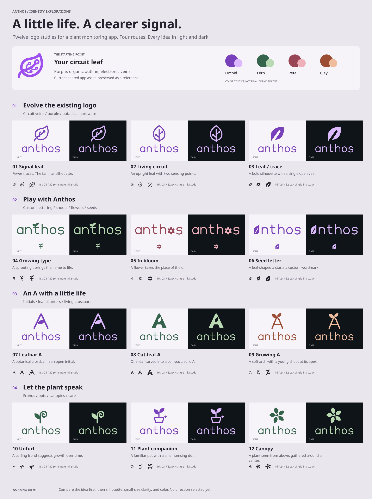

# Anthos logo experiments

Open [the browser moodboard](index.html) to compare and download individual SVGs, or view the [full PNG overview](moodboard.png). The [SVG overview](moodboard.svg) is scalable and editable.



## The existing logo

The earlier work is still in the repository:

- [design/logo/](../../design/logo/): original SVG experiments and exports.
- [design/logo_inspiration.png](../../design/logo_inspiration.png): the purple circuit leaf and “Living Laboratory” inspiration.
- [shared/src/logo.svg](../../shared/src/logo.svg): the bold purple circuit leaf imported by the app's shared assets module.
- [app/public/favicon-v2.svg](../../app/public/favicon-v2.svg): the finer circuit leaf referenced by the app's HTML.

The `references/` folder contains snapshots of the app mark, favicon, and inspiration image. The first row evolves this visual family. Production assets remain in their original locations.

## Working set 01

| Route | Concepts | Idea |
| --- | --- | --- |
| Existing logo | 01 Signal leaf · 02 Living circuit · 03 Leaf / trace | Reduce circuit detail while retaining the connection between plants and sensing. |
| Anthos | 04 Growing type · 05 In bloom · 06 Seed letter | Custom lettering with a sprouting t, flowering o, or leaf-shaped a. |
| A + botanical form | 07 Leafbar A · 08 Cut-leaf A · 09 Growing A | Make the initial carry the plant association. |
| Plant icon | 10 Unfurl · 11 Plant companion · 12 Canopy | Explore growth, a familiar potted plant, and a canopy seen from above. |

Every concept has light and dark background renders, a transparent mark, and a transparent horizontal lockup. Each wordmark concept has a companion icon taken from its distinctive letter. The lettering is custom path geometry, so logo files do not require installed fonts.

### Color studies

| Palette | Light-background ink | Dark-background ink | Role |
| --- | --- | --- | --- |
| Orchid | `#7940bb` | `#dcb8ff` | Continuity with the existing purple identity. |
| Fern | `#35634c` | `#b9d9b3` | A quieter botanical alternative. |
| Petal | `#984655` | `#f0b0ba` | Warmth for the flower wordmark. |
| Clay | `#9b4e34` | `#efbd9e` | A reference to terracotta pots. |

All concepts use the same comparison surfaces: light `#f6f4f8` and the app's dark `#0f1419`. These are identity experiments, not changes to app tokens or semantic status colors.

## What to compare next

My starting shortlist is **01 Signal leaf** for continuity, **04 Growing type** for personality in the name, and **08 Cut-leaf A** for a compact app mark.

- Inspect the 16, 24, and 32 px specimens at native size in the HTML overview. Small circuits and leaf counters need particular attention.
- Compare silhouettes before choosing colors. The strongest shape can take the existing purple palette.
- Check name recognition: 05 replaces the o with a flower, and 06's leaf-shaped a is intentionally more abstract.
- 10 and 12 favor botanical character over an explicit monitoring cue. 11 is more literal, but its sensing dot becomes secondary at small sizes.

No final direction has been selected. These are first-round concepts, not finalized optical-size icon sets.

## Files and regeneration

```text
docs/design/
├── index.html          # Responsive, offline browser overview and SVG downloads
├── moodboard.svg       # Portable vector overview
├── moodboard.png       # 1800 × 2410 rendered overview
├── logos/              # 12 concepts, 48 SVGs and 24 PNGs
│   ├── 01-signal-leaf-light.svg / .png
│   ├── 01-signal-leaf-dark.svg / .png
│   ├── 01-signal-leaf-mark.svg      # Transparent symbol
│   └── 01-signal-leaf-lockup.svg    # Transparent horizontal logo
├── references/         # Snapshots of prior work
├── concepts.json       # Concept IDs, descriptions, and ink colors
├── PRODUCT.md          # Context scoped to this exploration
└── generate.py         # Editable source geometry and board layout
```

From the repository root:

```sh
python docs/design/generate.py        # Standard-library Python, rebuild SVG/HTML/JSON
python docs/design/generate.py --png  # Also render PNGs; requires Inkscape on PATH
```

Edit `generate.py` for durable geometry or layout changes; regeneration overwrites the generated files. You can also edit an individual SVG in a vector editor and save it under a new filename for a separate iteration. PNG export uses the local Noto Sans font for overview annotations; logo geometry is independent of fonts. The checked-in PNG is the fixed overview reference.

The browser page opens directly from disk with no server, network, JavaScript, or package installation. It is a design document outside the application UI.
